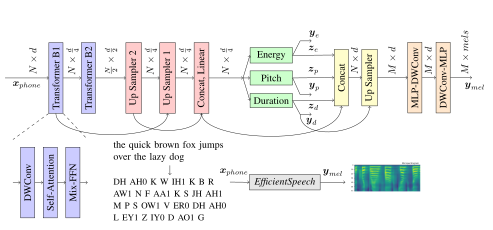

# EfficientSpeech: An On-Device Text to Speech Model

**EfficientSpeech**, or **ES** for short, is an efficient neural text to speech (TTS) model. It generates mel spectrogram at a speed of 104 (mRTF) or 104 secs of speech per sec on an RPi4. Its tiny version has a footprint of just 266k parameters. Generating 6 secs of speech consumes 90 MFLOPS only. 

## Paper

- [IEEE Xplore](https://ieeexplore.ieee.org/abstract/document/10094639)

## Model Architecture

**EfficientSpeech** is a shallow (2 blocks!) pyramid transformer resembling a U-Net. Upsampling is done by a transposed depth-wise separable convolution.



## Quick Demo

**Install**

```
pip install -r requirements.txt
```

If you encountered problems with cublas:

```
pip uninstall nvidia_cublas_cu11
```

**Tiny ES**

```
python3 demo.py --checkpoint https://github.com/roatienza/efficientspeech/releases/download/icassp2023/tiny_eng_266k.ckpt \
  --infer-device cpu --text "the quick brown fox jumps over the lazy dog" --wav-filename fox.wav
```

Output file is under `outputs`. Play the wav file:

```
ffplay outputs/fox.wav
```

After downloading the weights, it can be reused:

```
python3 demo.py --checkpoint tiny_eng_266k.ckpt --infer-device cpu  \
  --text "In additive color mixing, which is used for displays such as computer screens and televisions, the primary colors are red, green, and blue." \
  --wav-filename color.wav
```

Playback:

```
ffplay outputs/color.wav
```

**Small ES**

```
python3 demo.py --checkpoint https://github.com/roatienza/efficientspeech/releases/download/icassp2023/small_eng_952k.ckpt \
  --infer-device cpu  --n-blocks 3 --reduction 2  \
  --text "In subtractive color mixing, which is used for printing and painting, the primary colors are cyan, magenta, and yellow." \
  --wav-filename color-small.wav
```

Playback:

```
ffplay outputs/color-small.wav
```


**Base ES**

```
python3 demo.py --checkpoint  https://github.com/roatienza/efficientspeech/releases/download/icassp2023/base_eng_4M.ckpt \
  --head 2 --reduction 1 --expansion 2 --kernel-size 5 --n-blocks 3 --block-depth 3 --infer-device cpu  \
  --text " Why do bees have sticky hair?" --wav-filename  bees-base.wav
```

Playback:

```
ffplay outputs/bees-base.wav
```

**GPU** for Inference

```
python3 demo.py --checkpoint https://github.com/roatienza/efficientspeech/releases/download/icassp2023/small_eng_952k.ckpt \
  --infer-device cuda  --n-blocks 3 --reduction 2  \
  --text "In subtractive color mixing, which is used for printing and painting, the primary colors are cyan, magenta, and yellow."   \
  --wav-filename color-small.wav
```

### RPi4 Inference

`torch==1.13` generates `Illegal instruction` error on RPi4 but not on `torch==1.12`. Please downgrade the installed torch to resolve this issue.

```
pip3 install torch==1.12 torchvision==0.13
```

### ONNX 

Only supports fixed input phoneme length. Padding or truncation is applied if needed. Modify using `--onnx-insize=<desired valu>`.

```
python3 convert.py --checkpoint tiny_eng_266k.ckpt --onnx tiny_eng_266k.onnx
```

Might need to downgrade `protobuf` if an error occurs.

```
pip install protobuf==3.20
```

Usage:

```
python3 demo.py --checkpoint tiny_eng_266k.onnx --infer-device cpu  \
  --text "the primary colors are red, green, and blue."  --wav-filename primary.wav
```

### Train

**Data Preparation**

Use the unofficial [FastSpeech2](https://github.com/ming024/FastSpeech2) implementation to prepare the dataset.

**Tiny ES**

```
python3 train.py
```

**Small ES**

```
python3 train.py --n-blocks 3 --reduction 2
```

**Base ES**

```
python3 train.py --head 2 --reduction 1 --expansion 2 \
  --kernel-size 5 --n-blocks 3 --block-depth 3
```

## Comparison with other SOTA Neural TTS

[ES vs FS2 vs PortaSpeech vs LightSpeech](https://roatienza.github.io/efficientspeech-demo/)

## Credits

- [FastSpeech2 Unofficial Github](https://github.com/ming024/FastSpeech2)


## Citation
If you find this work useful, please cite:

```
@inproceedings{atienza2023efficientspeech,
  title={EfficientSpeech: An On-Device Text to Speech Model},
  author={Atienza, Rowel},
  booktitle={ICASSP 2023-2023 IEEE International Conference on Acoustics, Speech and Signal Processing (ICASSP)},
  pages={1--5},
  year={2023},
  organization={IEEE}
}
```
